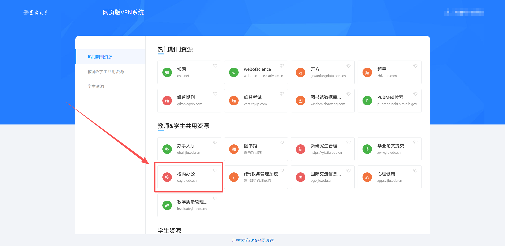
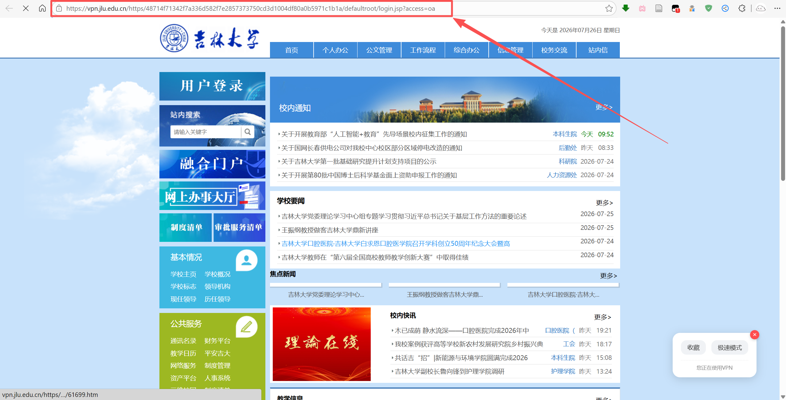

# JLU WebVPN

吉林大学校园网 **WebVPN 地址转换工具**，将普通网址转换为可通过深信服 SSL VPN 访问的内网地址。

## 功能

- **网址转换**：输入任意网址，一键生成 VPN 可访问链接
  - 短域名（≤16 字节）：直接使用全局密钥 XOR 加密
  - 长域名（>16 字节）：调用短网址 API 生成短链后转写（自动通过 CORS 代理）
- **一键复制**：复制生成的 VPN 链接到剪贴板
- **重新学习**：当链接不可用时，手动提交有效 URL 进行密钥学习

## 使用方式

1. 确保已登录 [JLU WebVPN](https://vpn.jlu.edu.cn)
2. 打开 [在线工具](https://Yummy-He.github.io/JLU-WebVPN)
3. 输入目标网址 → 点击转换 → 复制结果链接
4. 在新标签页打开复制的链接即可访问

### 故障排查：生成的链接不可用？

如果转换后的链接打不开，可以通过"重新学习"功能修复。操作步骤：

**第 1 步**：确保已登录 [JLU WebVPN](https://vpn.jlu.edu.cn)


**第 2 步**：在 VPN 页面中手动打开目标网址（此处以 OA 系统为例）



**第 3 步**：从浏览器地址栏复制实际可访问的完整 URL



**第 4 步**：回到转换工具页面，点击左侧"生成的链接不可用？"展开故障排查区域，再点击"开始排查"，填写表单后提交即可。

## 部署

本项目开箱即用，无需额外配置即可部署到 GitHub Pages。默认使用 `proxy.cors.sh` 作为 CORS 代理，如需更高可靠性可部署自己的代理（见下文）。

### 快速部署

```bash
# 仓库：Yummy-He/JLU-WebVPN
# Settings → Pages → Source → Deploy from branch → main 或 gh-pages → Save
```

### 可选：自定义 CORS 代理

如果默认代理不稳定，可部署自己的 Cloudflare Worker：

1. [Cloudflare Dashboard](https://dash.cloudflare.com/) → Workers & Pages → Create Worker
2. 粘贴 [`proxy/worker.js`](proxy/worker.js) 内容 → Deploy
3. 复制 Worker URL（如 `https://webvpn-proxy.xxxxx.workers.dev`）
4. 在 `js/config.js` 中将 `CORS_PROXY_URL` 替换为该 URL

### 本地预览

```bash
python3 -m http.server 8080
# 访问 http://localhost:8080
```

## 项目结构

```
├── index.html              # 主页面
├── css/
│   └── style.css           # 全局样式（Apple 风格）
├── js/
│   ├── config.example.js   # 配置文件模板（可提交到 Git）
│   ├── config.js           # 实际配置（不纳入版本控制）
│   ├── app.js              # 主应用逻辑与 UI 控制
│   ├── converter.js        # 转换核心算法
│   ├── shortener.js        # 短网址 API 封装
│   └── learner.js          # 重新学习模块
├── proxy/
│   └── worker.js           # Cloudflare Worker CORS 代理（可选）
├── .github/workflows/
│   └── deploy.yml          # GitHub Actions 自动部署脚本
├── fonts/                  # SF Pro 字体文件
└── .gitignore
```

## 技术原理

深信服 SSL VPN 的 URL 重写机制：对目标域名使用固定前缀 + XOR 密钥加密，拼接为 VPN 代理路径。本项目将这一算法从前端实现，所有运算在浏览器本地完成。

## 技术栈

- HTML5 + CSS3 + Vanilla JavaScript
- 无外部框架依赖
- GitHub Pages 部署

## 许可

MIT
